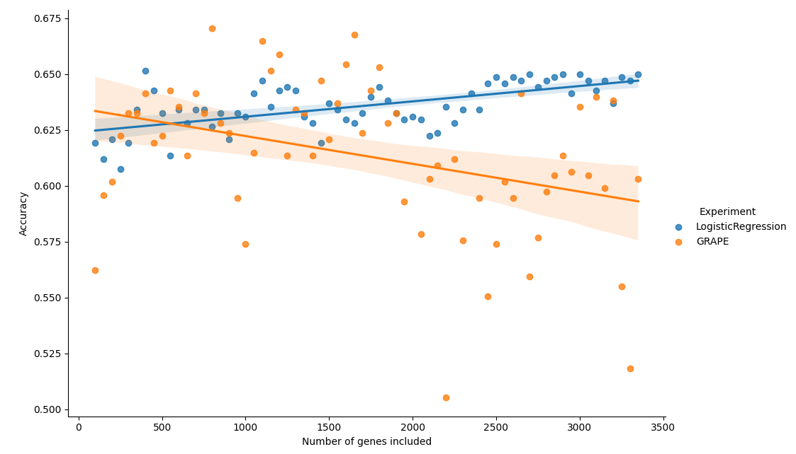

In this blog post, I'd like to share my recent project on applying deep learning techniques to single-cell RNA sequencing (scRNA-seq) data. As an AI researcher, you're likely familiar with the challenges of working with complex, high-dimensional data. scRNA-seq data presents a unique set of challenges that make it an interesting problem for machine learning applications.

## The Challenge of scRNA-seq Data

scRNA-seq technologies have revolutionized our ability to capture genetic data from individual cells. The output is a gene expression matrix representing the counts of genes expressed in each cell. While this data could lead to significant innovations in personalized medicine, it's notoriously difficult to analyze due to several factors:

1. Noise in the data
2. High dimensionality
3. Extreme sparsity (up to 90%)
4. Unexpected abundance of zero values

These characteristics make scRNA-seq data a challenging target for traditional machine learning approaches.

## Applying Graph Neural Networks: The GRAPE Framework

To tackle this challenge, I applied the GRAPE framework to the gene expression matrix. GRAPE is an interesting approach that transforms tabular data into a bipartite graph. Here's how it works:

- Variables (genes) are represented by one set of nodes
- Observations (cells) are represented by another set of nodes
- The values in the cells of the table become edge weights between the respective variable-observation pairs

I then used graph neural networks to perform classification of cell types on this bipartite graph structure.

## Initial Results and Scaling Issues

My initial experiments with GRAPE showed promising results when working with a small subset of genes. However, I noticed that performance degraded rapidly as more genes were added to the model. This raised an interesting question: why does adding more information (in the form of additional genes) lead to worse performance?

As you can see in the figure above, the GRAPE model's performance declines as we increase the number of genes from 100 to 3500.

## Incorporating Biological Domain Knowledge

To address this scaling issue, I proposed a new methodology that incorporates biological pathway information into the message passing procedure of the graph neural network. The idea was to use domain knowledge to restrict the number of incoming messages during the aggregation step.

### Biological Pathways

For those unfamiliar with the concept, biological pathways are an important abstraction in molecular biology. They represent how molecule-level interactions perform larger scale tasks, leading to changes in cell composition or behavior. I used genetic pathways, a subcategory that links genes to known biological processes.

### Modifying the GRAPE Model

I modified the GRAPE model to use this pathway information. Here's a high-level overview of the changes:

1. Created a binary matrix linking genes to pathways
2. Modified the message function to output a separate dimension for each pathway
3. Applied a mask to incoming messages, excluding genes not involved in each pathway
4. Concatenated these masked messages with node features for the update function

The mathematical details of this process are as follows:

Let's define a matrix, $\mathbf{P} \in \mathbb{R}^{N\times M}$, where rows represent genes and columns represent pathways. For a series of genes $g=\{g_1, \ldots , g_n\}$ and pathways $p=\{p_1, \ldots, p_m\}$ where $p_j = \{g_{j1}, \ldots, g_{jk}\}$ is the series of genes present in that pathway, we define $\hat{\mathbf{P}}$ as:

$$
   \hat{\mathbf{P}}_{ij} = \begin{cases} 
      1 & g_i\in p_j \\
      0 & g_i\notin p_j 
   \end{cases}
$$

Then, we normalize this matrix:

$$
    \mathbf{P}_{ij} = \frac{\hat{\mathbf{P}}_{ij}}{\sum_{i=0}^N \hat{\mathbf{P}}_{ij}}
$$

The layer update function for the modified GRAPE model becomes:

$$
h_u^{\ell+1} = \phi \Bigg( h_u^{\ell}, \sum_{v \in V} \Big( \mathbf{P}_v * \psi \left( h_v^{\ell}, e_{uv} \right) \Big) \Bigg)
$$

where $*$ represents element-wise multiplication, $\psi: \mathbb{R}^{|e| + |h|} \mapsto \mathbb{R}^{M}$, and $\mathbf{P}_v$ is the row of the pathways matrix corresponding to gene $v$.

## Results and Discussion

I compared four models in my experiments:

1. A logistic regression baseline
2. The original GRAPE model
3. The GRAPE model with added biological pathways information
4. A GRAPE model with a random matrix in place of the pathways information

Here are the results:

The GRAPE variant incorporating biological pathways information significantly outperformed the others and scaled better with increasing numbers of genes. This suggests that the incorporation of domain knowledge may have effectively mitigated the hypothesized aggregation problem.

Interestingly, while the GRAPE Pathways model was more resilient to larger numbers of connections, it didn't actively benefit from additional genes like the logistic regression baseline did. This indicates that either the detriment of having a larger graph is offsetting the benefit of additional information, or the model is unable to fully utilize this additional information.

## Conclusion

This project demonstrates an interesting case where biological knowledge, in the form of pathways information, was used to introduce an inductive prior on the GRAPE framework. This approach boosted performance and improved scaling capability.

The superior performance of the model with the pathways matrix compared to the random matrix serves as a proof-of-concept for further incorporation of pathway information into deep learning models for single-cell analysis.

As we continue to tackle complex biological data with deep learning techniques, it's likely that effectively leveraging domain knowledge will be crucial for outperforming existing methods in computational biology.

I hope this exploration provides some interesting insights into the intersection of deep learning and bioinformatics. If you're working on similar problems or have thoughts on this approach, I'd be excited to hear from you!

## References

[1] Lähnemann, D., et al. (2020). Eleven grand challenges in single-cell data science. Genome Biology, 21(1), 31.

[2] Eraslan, G., et al. (2019). Single-cell RNA-seq denoising using a deep count autoencoder. Nature communications, 10(1), 390.

[3] Baruzzo, G., et al. (2020). Simulation-based comprehensive benchmarking of RNA-seq aligners. Nature methods, 17(1), 96-103.

[4] Hicks, S.C., et al. (2018). Missing data and technical variability in single-cell RNA-sequencing experiments. Biostatistics, 19(4), 562-578.
