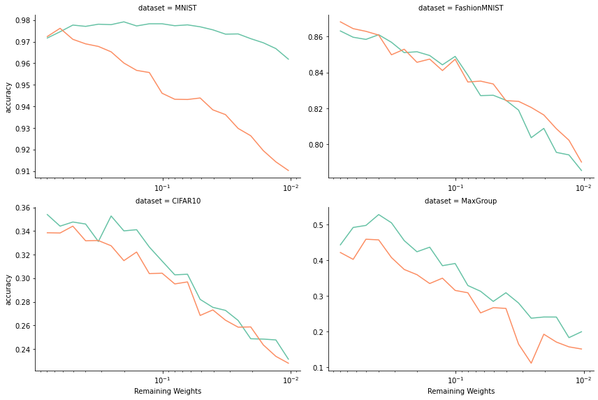
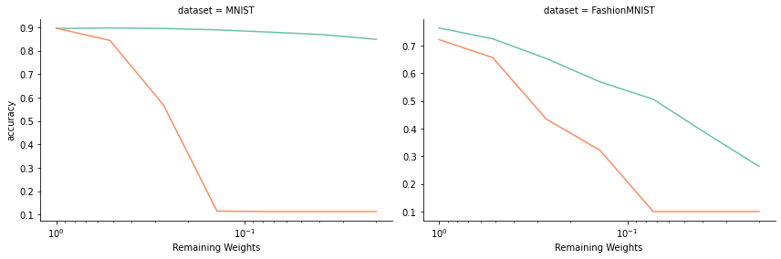

## Introduction

In the realm of deep learning, the capacity of neural networks to generalize well despite having far more parameters than training instances has been a subject of intense study. The seminal paper by Zhang et al. (2021) challenged traditional notions of generalization by demonstrating that neural networks can easily fit random labels while still exhibiting surprisingly good generalization performance on real data.

In this context, the Lottery Ticket Hypothesis, introduced by Frankle and Carbin (2018), provides an intriguing perspective on the relationship between network size and performance. This hypothesis posits that dense, randomly initialized neural networks contain sparse subnetworks that, when trained in isolation, can match the test performance of the original network.

In this blog post, I'll share my experience replicating the base results of the original Lottery Ticket Hypothesis paper and extend the experiment to explore the transferability of "winning tickets" across different datasets.

## The Lottery Ticket Hypothesis

The Lottery Ticket Hypothesis states that within any randomly initialized neural network, there exists a subnetwork that, when trained on the same dataset, can achieve similar accuracy to the initial network in at most the same number of training steps. This subnetwork, termed a "winning ticket," is distinguished by its special initialization values.

This hypothesis has profound implications for our understanding of neural network generalization. It suggests that the improved performance of larger networks might be due to the exponentially greater number of potential winning tickets they contain, rather than the increased dimensionality of the optimization space.

## Experimental Setup

To investigate this hypothesis, I set up an experiment following the procedure outlined in the original paper, with some modifications:

1. Initialize an MLP with 2 hidden layers (300 and 100 neurons).
2. Train the network on the MNIST dataset until convergence.
3. Prune the smallest weights from each layer, aiming to reach a final proportion of $p_{final}$ weights after $n$ rounds.
4. Reinitialize one network with the original weights (keeping the pruning mask) and another with random weights.
5. Repeat these steps while monitoring accuracy as pruning increases.

Additionally, I extended the experiment by:

6. Before each pruning round, training the network from the same initialization on three test datasets: FashionMNIST, CIFAR10, and a custom "MaxGroup" dataset.

The networks were trained with a learning rate of 1.2e-3, and for each pruning iteration, they were trained for 10 epochs (approximately 4500 batches).

## Results and Discussion

### Replication of Original Findings

I successfully replicated the main results of the original paper, observing that the "winning ticket" networks maintained high performance even with as few as 5% of their initial weights, while randomly reinitialized networks showed a sharp decline in accuracy with up to 50% of weights remaining.

*Figure 1: Accuracy of neural networks at varying degrees of pruning for randomly initialized weights (orange) and weights initialized according to the iterative pruning procedure (green).*

### Generalization to Other Datasets

Interestingly, the winning ticket networks did not outperform randomly initialized networks when trained and evaluated on datasets other than MNIST (the dataset used to find the winning tickets). This suggests that the benefits of winning tickets might be dataset-specific, at least in the case of simple multilayer perceptrons.

However, I observed an unexpected phenomenon: when trained with a very high learning rate (1e-2) and an SGD optimizer for only 3 epochs, the winning ticket networks performed significantly better than randomly initialized networks, even on different datasets.

*Figure 2: Accuracy of a winning ticket network found with MNIST and trained on FashionMNIST with a high learning rate.*

This curious result might be related to the finding by Zhou et al. (2019) that the best winning tickets tend not to change signs during training. With a high learning rate, optimization has fewer opportunities to change direction, potentially allowing subnetworks with beneficial initial orientations to maintain their advantage.

## Implications and Further Research

The Lottery Ticket Hypothesis and subsequent research have shed light on the role of initialization in neural network training and generalization. Some key findings from recent literature include:

1. The importance of sign stability in winning tickets (Zhou et al., 2019).
2. The existence of "supermasks" that perform well even without training.
3. The "Multi-Prize Lottery Ticket Hypothesis" suggesting the existence of multiple robust subnetworks at initialization (Diffenderfer et al., 2021).
4. The development of efficient methods to identify lottery tickets without expensive training procedures (Zhang et al., 2021).
5. The proof that sufficiently overparameterized networks always contain accurate subnetworks (Malach et al., 2020).

## Conclusion

The Lottery Ticket Hypothesis provides valuable insights into the workings of neural network training and the relationship between overparameterization and generalization performance. My replication of the original findings confirms the existence of winning tickets in simple MLPs trained on MNIST. However, my attempts to transfer these winning tickets to other datasets were less successful, suggesting that the benefits might be dataset-specific for simpler architectures.

The unexpected performance boost observed with high learning rates on transfer tasks opens up intriguing questions about the nature of winning tickets and their interaction with optimization dynamics. This phenomenon warrants further investigation and could potentially lead to new insights into transfer learning and network initialization strategies.

As we continue to unravel the mysteries of deep learning, the Lottery Ticket Hypothesis remains a fertile ground for research, offering tantalizing clues about the fundamental principles underlying neural network performance and generalization.

## References

1. Zhang, C., et al. (2021). Understanding deep learning requires rethinking generalization.
2. Frankle, J., & Carbin, M. (2018). The lottery ticket hypothesis: Finding sparse, trainable neural networks.
3. Zhou, H., et al. (2019). Deconstructing lottery tickets: Zeros, signs, and the supermask.
4. Diffenderfer, J., et al. (2021). Multi-prize lottery ticket hypothesis: Finding accurate binary neural networks by pruning a randomly weighted network.
5. Malach, E., et al. (2020). Proving the lottery ticket hypothesis: Pruning is all you need.
