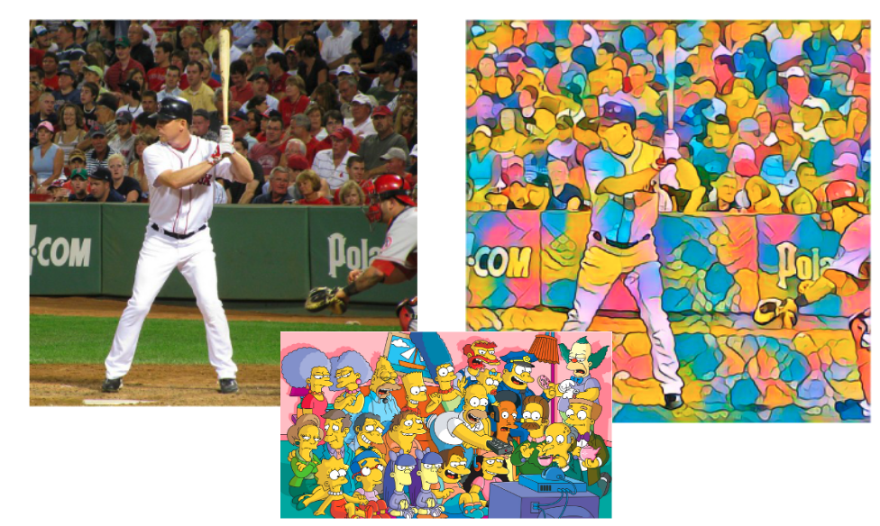
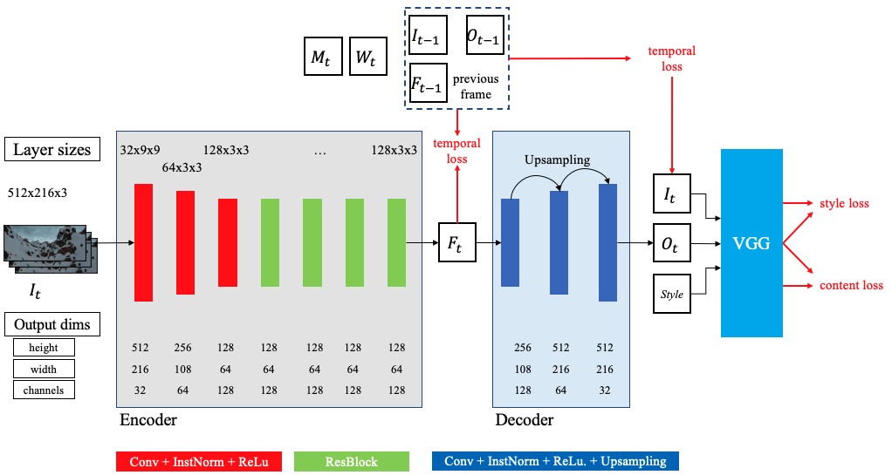

## Introduction

Neural Style Transfer (NST) has revolutionized the intersection of artificial intelligence and art, allowing us to reimagine images in the style of famous artworks. While this technique has evolved to handle real-time video processing on GPUs, the majority of practical applications involve mobile devices. This poses a significant challenge: how can we perform on-device inference to reduce latency and increase data privacy?

In this project, we implemented real-time neural style transfer on a Coral Edge TPU device using a modified version of ReCoNet. To our knowledge, this is the first implementation capable of running video neural style transfer on a mobile device. Our goal was to prove that a model of ReCoNet's complexity could be run on edge hardware, opening up new possibilities for on-device AI applications.

## Neural Style Transfer: A Deep Dive

### Background

Neural Style Transfer, introduced by Gatys et al. in 2015, allows us to combine the high-level content of one image with the style of another. It works by leveraging the feature representations in convolutional neural networks (CNNs) to separate and recombine the content and style of arbitrary images.

The key insight is that the feature maps of CNN layers preserve high-level content while discarding detailed pixel information. Conversely, style information can be separated from the global scene by computing style feature correlations between CNN layers.

Here's an example of neural style transfer:

*Figure 1: An example of Neural style transfer showing the original image (left), the style image (middle) and the output image (right)*

### The Challenge of Video

Applying NST to videos introduces a new challenge: temporal consistency. When style transfer is applied frame-by-frame with independent random initializations, consecutive frames can converge to different local minima, resulting in a strong flickering effect.

Previous approaches to solve this problem either failed to achieve real-time processing speeds or exhibited unstable color appearances. This is where ReCoNet comes in.

## ReCoNet: Real-time Consistent Neural Style Transfer Network

ReCoNet addresses the challenges of real-time video style transfer through several key innovations:

1. An encoder-decoder architecture based purely on CNNs
2. Feature and output-level temporal loss calculated using optical flow warping (only during training)
3. A luminance warping constraint in the output temporal loss
4. Feature-level temporal loss to improve consistency on traceable objects

### Network Topology

ReCoNet implements an encoder-decoder architecture purely based on Convolutional Neural Networks. Here's a visual representation of the network topology:

*Figure 2: ReCoNet topology with adjusted dimensions to run on Edge TPU, where $I_t$ denotes the input image, $F_t$ the feature map, $O_t$ the stylized output image, $M_t$ the occlusion mask between frames $t$ and $t-1$, and $W_t$ is the optical flow between the frames.*

The encoder consists of three convolutional layers of shapes (32/64/128x3x3) and stride sizes (1,2,2), followed by instance normalization and ReLU activations respectively. This is followed by four residual block layers which apply 128 and another pass through instance normalization and ReLU. The decoder consists of two upsampling layers, which are respectively followed by the same convolution + instance normalization + ReLU layer used in the encoder, here with shapes (64/32x3x3) and a single stride length.

Every layer in this topology is using instance normalization directly after the convolution, which Gao et al. claim to attain better stylization quality. However, this posed a challenge in our implementation as instance normalization is not supported natively by the Edge TPU compiler.

### Loss Function

The loss function of ReCoNet is crucial for achieving clear style and content separation while ensuring temporal consistency:

$$
\mathcal{L}(t-1, t) = \sum\_{i \in \{t-1, t\}}(\alpha\mathcal{L}\_\textit{content}(i) 
                    + \beta\mathcal{L}\_{\textit{style}}(i)) 
                    + \gamma\mathcal{L}\_{\textit{tv}}(i)
                    + \lambda\_f\mathcal{L}\_{\textit{temp,f}}(t-1, t) 
                    + \lambda\_o\mathcal{L}\_{\textit{temp,o}}(t-1, t)
$$

Where:
- $\mathcal{L}_\textit{content}$ is the content loss
- $\mathcal{L}_{\textit{style}}$ is the style loss
- $\mathcal{L}_{\textit{tv}}$ is total variation regularization
- $\mathcal{L}_{\textit{temp,f}}$ is feature-level temporal loss
- $\mathcal{L}_{\textit{temp,o}}$ is output-level temporal loss

#### Content Loss

Content loss is defined as the mean squared error between the feature representations of the original and generated images:

$$
\mathcal{L}_{\textit{content}}(\vec{p}, \vec{x}, l) = \frac{1}{C_jH_jW_j} \sum_{i,j}(F_{ij}^{l} - P_{ij}^l)^2
$$

Where $F_{ij}^{l}$ and $P_{ij}^l$ are the feature map activations of the generated image and the original image, respectively.

#### Style Loss

Style loss is calculated using the gram matrices of the feature maps:

$$
\mathcal{L}_{\textit{style}}(\vec{a},\vec{x}) = (\sum_{l=0}^{L}w_l) \frac{1}{4 N_l^2 M_l^2} \sum_{i,j}(G_{ij}^l - A_{ij}^l)^2
$$

Where $G_{ij}^l$ and $A_{ij}^l$ are the gram matrices of the generated image and the style image, respectively.

#### Temporal Losses

The output-level temporal loss penalizes deviations along the point trajectories of the frames, using optical flow to account for motion:

$$
\mathcal{L}_\textit{temp,o}(t-1, t) = \sum_{c} \frac{1}{D} M_t ||(O_t - W_t(O_{t-1}))_c - (I_t - W_t(I_{t-1}))_Y||^2
$$

The feature-level temporal loss enforces consistency between the features:

$$
\mathcal{L}_\textit{temp,f}(t-1, 1) = \frac{1}{D} M_t ||(F_t - W_t(F_{t-1})||^2
$$

## Implementation on the Coral Edge TPU

### The Coral Edge TPU

The Coral Edge TPU is a hardware accelerator designed for fast, power-efficient, highly parallelized arithmetic on unsigned 8-bit integers. It's capable of performing 4 trillion operations per second (TOPS) while consuming only 2 watts of power.

Our setup consisted of three main components:
1. A Coral DevBoard
2. An accelerator module
3. A camera unit

The Coral Dev Board is a single-board computer with a 64-bit 1.5GHz ARM Cortex-A35 CPU, a 1.6 GP/sec GPU @600 MHz, 2GB of RAM, and 8GB of flash memory. The ML accelerator module can perform 4 TOPS using only 2 watts of power.

### End-to-End System

Here's a high-level overview of our end-to-end system for running real-time video style transfer on the Edge TPU:

*Figure 3: High-level infrastructure used to run style Transfer on Edge TPU*

We implemented the ReCoNet training compatible with Python 3.7.12 to run training on Google Colab. We trained the model on the resized (512x216p) images, optical flow, and occlusions masks from the MPI Sintel Dataset and some generic style images before quantising the weights to ensure compatibility of the trained model with TFLite. We then convert the quantised model to a TFLite model to compile and load it onto the DevBoard. We use a standard 1080x720p camera module to feed live images that can be inferred on the Edge TPU.

### Challenges and Solutions

Implementing ReCoNet on the Edge TPU posed several significant challenges:

1. **Compatibility**: We needed to re-implement ReCoNet in TensorFlow and quantize the model to run on unsigned 8-bit integers.

2. **Software constraints**: The Edge TPU compiler only supports a subset of TensorFlow Lite operations. We had to write custom implementations for upsampling and instance normalization.

3. **Hardware constraints**: The Edge TPU has limited memory and processing capabilities compared to GPUs.

To address these challenges, we:

- Re-implemented ReCoNet in TensorFlow
- Quantized the model after training to run on unsigned 8-bit integers
- Wrote custom implementations of upsampling and instance normalization using only operations supported by the Coral TPU
- Made slight adjustments to the ReCoNet network topology to fit within memory constraints

### Quantization and Compilation

The Edge TPU has 8MB of SRAM which is used to cache the model parameters. The TPU module supports only operations on 8-bit integers, which means that full integer quantisation must be performed on TensorFlow models before they can be run. We used TensorFlow's post-training quantization to convert to 8-bit integers.

After quantization, the model was compiled using the Edge TPU compiler, which imposes strict constraints on supported operations. Finally, we deployed the compiled model to the Edge TPU using Coral's Mendel Development Tool.

## Results and Analysis

After implementing ReCoNet, training it on the MPI-Sintel dataset, and running video inference on the TPU using Van Gogh's "Starry Night" as the style image, we encountered three main challenges:

1. **Instance Normalization**: The broadcasting operations required for instance normalization didn't compile onto the TPU. Removing instance normalization significantly degraded the stylized output.

2. **Quantization**: The quantization required for TensorFlow Lite conversion led to a minor loss in inference quality. However, the model proved relatively robust to quantization.

3. **Upsampling**: The upsampling operation in the decoder was mapped to the CPU, significantly slowing down inference speed.

Here are the visual results of our experiments:

*Figure 4: Stylised output of a video scene in Cambridge. (a) Style image, (b) Original Frames, (c) No instance normalisation, (d) Quantised with instance norm, (e) Non-quantised with instance norm*

As we can see:

- Without instance normalization (c), the stylized output lacks the characteristic "stroke" of Van Gogh's style.
- The quantized model with instance normalization (d) shows a good balance of content preservation and style transfer.
- The non-quantized model (e) provides the best perceptual quality but cannot be run on the Edge TPU.

Despite these challenges, our implementation achieved style and content separation, with objects in the scene clearly distinguished and consistently styled across frames. The style and content separation appears to be working well. All of the main objects in the scene (e.g., King's chapel) are clearly separated and a different style is applied to the objects compared to the background. The style also clearly resembles the colour schemes and "stroke" of the "starry night" scene.

The objects and background in both the quantised and non-quantised versions receive the same stylisation across frames in the video, showing that the temporal consistency imposed by the temporal output and feature losses works well.

### Performance Metrics

Here's a comparison of the video processing speed on the Coral Edge TPU with and without upsampling:

*Figure 5: Video processing speed on the Coral Edge TPU with and without upsampling*

As we can see, the upsampling operation significantly impacts the inference speed, reducing it from 15 FPS to 0.4 FPS when mapped to the CPU. Our hypothesis is that a large amount of the delay is caused by the communication cost between the TPU and CPU.

## Discussion and Future Work

While we've demonstrated the feasibility of near real-time video style transfer on an Edge TPU device, software limitations, particularly those of the proprietary Edge TPU compiler, prevented us from achieving sufficient perceptual quality and inference speed.

The issues we encountered are not insurmountable, and we believe it would be entirely possible to meet all of the technical and qualitative requirements for real-time style transfer on this device if support was introduced for the remaining operations by the Edge TPU compiler. Future work could explore:

1. **Knowledge Distillation**: Training a student model without instance normalization using a teacher network with instance normalization. This could potentially capture the benefits of instance normalization without requiring the operation itself. If the benefits of instance normalisation in improving temporal consistency in video of shifting light-dark balances are a bi-product of the unsupervised manner in which neural style transfer models are trained, this approach could be particularly effective.

2. **Alternative Normalization Techniques**: Developing functionally similar operations to upsampling and instance normalization using only convolution filters and activation functions supported by the Edge TPU compiler. Since weights of convolution filters can be manually set in TensorFlow and then compiled for the TPU, some bespoke set of weights may be sufficient to achieve similar results to those techniques while using only operations that are well supported by the compiler.

3. **Compiler Optimization**: Working with the Edge TPU team to expand support for crucial operations like broadcasting and bilinear interpolated upsampling.

Given the robustness of the stylization procedure to quantization and the consistency of stylization across consecutive frames, we believe this area warrants further exploration. With improved compiler support and innovative workarounds, real-time video neural style transfer on edge devices could soon become a reality, opening up exciting possibilities for on-device AI applications in areas like augmented reality, real-time video editing, and more.

---

*For more details and code, visit our [GitHub repository](https://github.com/konst-int-i/reconet-tensorflow).*
